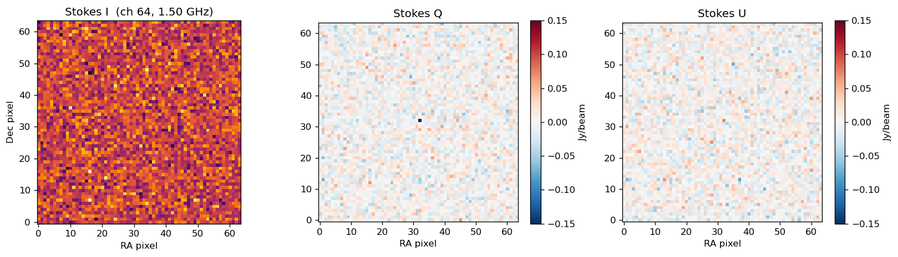
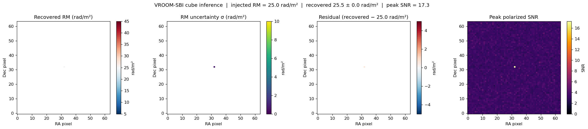
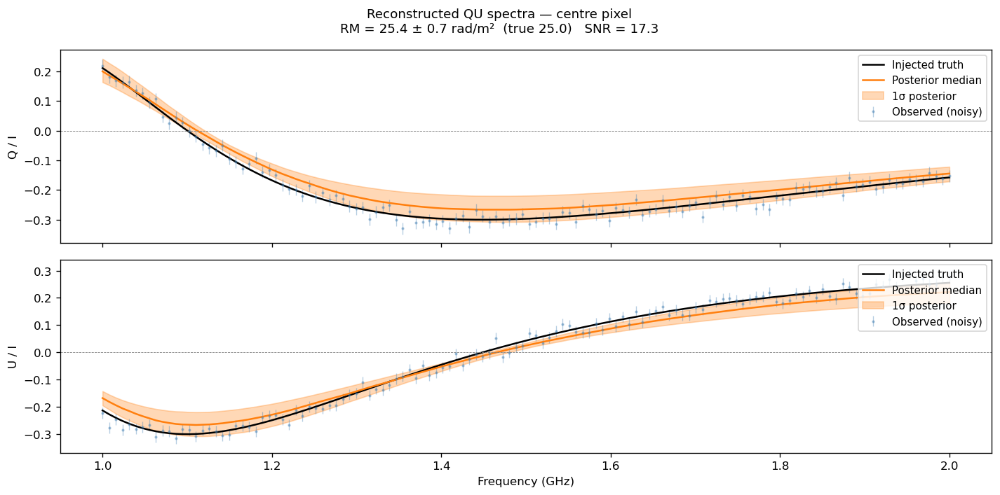
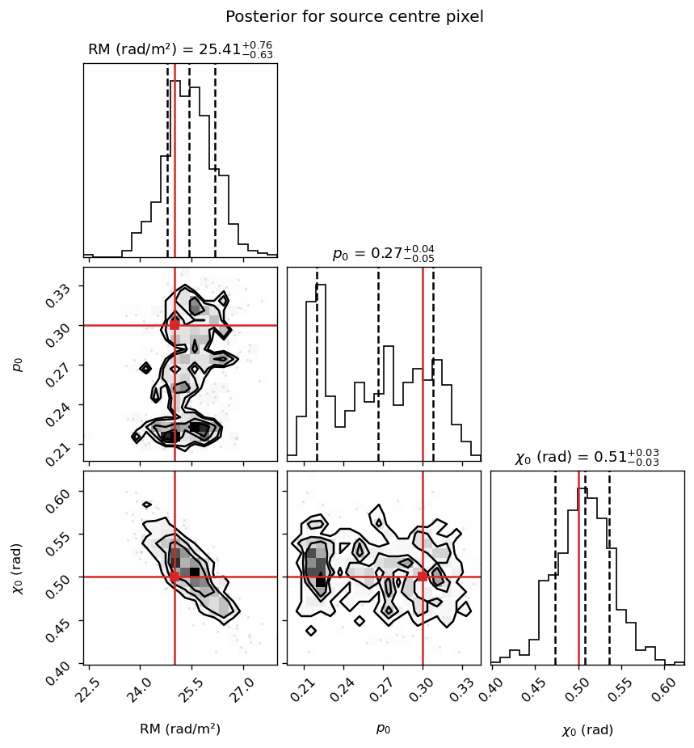

# VROOM-SBI

[](https://github.com/skunkworks-ra/vroom-sbi/actions/workflows/tests.yml)
[](https://github.com/skunkworks-ra/vroom-sbi/actions/workflows/lint.yml)
[](https://www.python.org/)
[](https://pytorch.org/)
[](https://huggingface.co/skunkworks-ra/vroomsbi)

Simulation-Based Inference for Rotation Measure Synthesis. Given observed Q(λ²) and U(λ²) spectra, VROOM-SBI returns a full posterior probability distribution over Faraday depth structure using pre-trained neural posterior estimators.

Pre-trained models: [huggingface.co/skunkworks-ra/vroomsbi](https://huggingface.co/skunkworks-ra/vroomsbi)

Paper: Pal & Jagannathan (submitted)

---

## Table of contents

- [Installation](#installation)
- [Frequency setup and observing constraints](#frequency-setup-and-observing-constraints)
- [Quickstart: inference on FITS cubes](#quickstart-inference-on-fits-cubes)
- [Paper figures](#paper-figures)
- [Worked example: two-component Faraday-thin source](#worked-example-two-component-faraday-thin-source)
- [Posterior validation summary](#posterior-validation-summary)
- [Interpreting results](#interpreting-results)
- [Computational performance](#computational-performance)
- [Training your own models](#training-your-own-models)
- [Requirements](#requirements)
- [Contributing](#contributing)
- [Use of AI assistance](#use-of-ai-assistance)

---

## Installation

### Inference only (pip)

If you just want to run inference with the pre-trained models:

```bash
git clone https://github.com/skunkworks-ra/vroom-sbi
cd vroom-sbi
pip install -e .
```

For FITS cube inference, also install the IO extras:

```bash
pip install -e ".[io]"
```

### Development (pixi)

We develop with [pixi](https://pixi.sh), a fast cross-platform package manager built on conda-forge. It handles the full environment including PyTorch and all dependencies without requiring a separate conda installation.

```bash
# Install pixi (if you don't have it)
curl -fsSL https://pixi.sh/install.sh | sh

# Clone and set up
git clone https://github.com/skunkworks-ra/vroom-sbi
cd vroom-sbi
pixi install        # installs all environments defined in pixi.toml
pixi shell          # activates the default environment
```

Available environments:

| Environment | Use |
|-------------|-----|
| `default` | train, infer, validate |
| `io` | default + FITS cube I/O ([spectral-cube](https://spectral-cube.readthedocs.io)) |
| `dev` | default + testing tools |
| `cube-dev` | io + testing (used in CI) |
| `notebooks` | io + [JupyterLab](https://jupyter.org) + nbconvert |

Common tasks:

```bash
pixi run test               # run tests
pixi run lint               # check linting
pixi run -e notebooks notebook          # open JupyterLab
pixi run -e notebooks execute-notebook  # run the quickstart notebook
```

---

## Frequency setup and observing constraints

VROOM-SBI is trained on a specific λ² sampling defined by `freq.txt`. The pre-trained models ship with the following L-band setup:

| Property | Value |
|----------|-------|
| Frequency range | 1.0 -- 2.0 GHz |
| Number of channels | 128 |
| Channel width | ~7.87 MHz |
| λ² range | 0.023 -- 0.090 m² |
| λ² span (Δλ²) | 0.067 m² |

These translate to the following RM synthesis figures of merit:

| Figure of merit | Value | Notes |
|----------------|-------|-------|
| RMSF FWHM (RM resolution) | ~51 rad/m² | Set by Δλ² = 0.067 m² |
| Max detectable RM scale | ~140 rad/m² | Set by λ²_min = 0.023 m² |
| RM prior range | -100 to +100 rad/m² | Covers the extragalactic RM range at L-band |
| RM dispersion prior (σ_φ) | 0 -- 50 rad/m² | For external/internal dispersion models |
| Faraday thickness prior (Δφ) | 0 -- 50 rad/m² | For Burn slab model |

**Why the prior range matters.** The RMSF FWHM of ~51 rad/m² sets the minimum separation at which two RM components can be independently resolved. Components closer than ~25 rad/m² will produce degenerate posteriors with large uncertainties.

**Channel flagging.** The weight augmentation during training simulates scattered flagging (30% probability), contiguous RFI gaps (30%), and large RFI blocks (10%), using continuous inverse-variance weights rather than binary masks. The trained posteriors degrade gracefully under realistic flagging -- the MACS J1752+4440 science case in the paper used 78 of 128 channels (50 excised for RFI) without retraining.

**Using different frequency coverage.** To train on a different array or subband, replace `freq.txt` with your own channel list (one frequency in Hz per line, optional second column for per-channel weights), update the prior ranges in `config.yaml` if your RM range differs, and retrain. The network architecture does not change.

---

## Paper figures

[`notebooks/paper_figures.ipynb`](notebooks/paper_figures.ipynb) reproduces all figures in Pal & Jagannathan (submitted). Run it with the `notebooks` pixi environment:

```bash
pixi run -e notebooks notebook
```

---

## Quickstart: inference on FITS cubes

[`notebooks/quickstart_fits_cube.ipynb`](notebooks/quickstart_fits_cube.ipynb) is a
self-contained worked example. It builds a synthetic 64x64 IQUV cube (VLA L-band,
128 channels) with a single-pixel Faraday-thin point source injected at the centre,
runs masked inference on that pixel, and plots the results. All outputs below come
from running the notebook as-is.

**Cube quick-look** -- Stokes I, Q, and U at the midband channel. The source is a
single pixel at centre; the rest of the map is noise (σ = 0.02 in fractional
polarization units, peak SNR = 15 per channel).



**RM recovery** -- recovered RM map, posterior uncertainty, residual, and SNR map.
Only the masked source pixel was processed (1 of 4096). Injected RM = +25 rad/m²,
recovered 25.5 ± 0.7 rad/m².



**Reconstructed QU spectra** -- posterior median and 1σ envelope overlaid on the
observed (noisy) data and the noiseless injected truth.



**Posterior corner plot** -- marginal posteriors for RM, p₀, and χ₀ at the source
pixel, with injected truth marked in red.



Models download automatically from HuggingFace the first time you run inference --
no separate download step required. To pre-fetch explicitly:

```bash
vroom-sbi download
```

### Polarimetric inference (RM and depolarization)

```bash
vroom-sbi cube-infer-pol \
    --cube-q Q.fits \
    --cube-u U.fits \
    --cube-i I.fits \
    --output-dir cube_results/
```

Providing `--cube-i` fits the total-intensity spectral shape per pixel first, then divides Q and U by the posterior mean I(ν) model before RM inference. This suppresses per-channel noise amplification from dividing by the raw noisy I spectrum. Without it, the input is assumed to already be in fractional polarization units.

Active pixels are selected where the frequency-collapsed polarized intensity exceeds 5σ_P (adjustable with `--snr-threshold`). All other pixels are set to NaN in the output maps.

### Supplying a mask

If you already have a region file or source catalog defining which pixels to process, pass a 2D FITS mask -- non-zero pixels are processed, all others are skipped regardless of SNR:

```bash
vroom-sbi cube-infer-pol \
    --cube-q Q.fits \
    --cube-u U.fits \
    --cube-i I.fits \
    --mask source_mask.fits \
    --snr-threshold 3.0 \
    --output-dir cube_results/
```

The mask and SNR threshold are applied together: a pixel must be both non-zero in the mask and above the SNR threshold to be processed. Using a mask is the recommended approach when you have a clean source catalog, because it avoids spending inference time on empty sky.

### Spectral index inference (total intensity only)

```bash
vroom-sbi cube-infer-spectra \
    --fits I.fits \
    --model models/spectral_shape_posterior.pt \
    --snr-threshold 5.0 \
    --output-dir spectra_results/
```

### Output maps

Both modes write one FITS file per parameter per component:

```
cube_results/
  rm_mean_comp1.fits      # posterior mean RM, component 1
  rm_std_comp1.fits       # posterior std (1-sigma)
  rm_p16_comp1.fits       # 16th percentile
  rm_p84_comp1.fits       # 84th percentile
  amp_mean_comp1.fits
  chi0_mean_comp1.fits
  sigma_phi_mean_comp1.fits   # dispersion models only
  delta_phi_mean_comp1.fits   # Burn slab only
```

---

## Worked example: two-component Faraday-thin source

This example simulates two Faraday-thin components with φ₁ = +15 rad/m² and φ₂ = −44.5 rad/m² (Δφ = 59.5 rad/m²).

```python
import numpy as np
from vroom_sbi.simulator import RMSimulator
from vroom_sbi.inference import InferenceEngine

sim = RMSimulator("freq.txt", n_components=2, model_type="faraday_thin")
theta_true = np.array([[15.0, 0.5, 0.8,      # [RM, p0, chi0]  component 1
                        -44.5, 0.4, 1.2]])    # [RM, p0, chi0]  component 2

qu_noiseless = sim.simulate_noiseless(theta_true)  # shape (256,): [Q_0..Q_127, U_0..U_127]

# Add noise (sigma = 0.02, ~SNR 25 per channel for p0 = 0.5)
rng = np.random.default_rng(42)
qu_obs = qu_noiseless + rng.normal(0, 0.02, qu_noiseless.shape)

# Run inference
engine = InferenceEngine(model_dir="models")
engine.load_models()
result, all_results = engine.infer(qu_obs, n_samples=5000)
```

The two components are separated by 59.5 rad/m², above the ~51 rad/m² RMSF FWHM, so they are resolved. Both rotation measures recover to within 2 rad/m² of the injected truth (see the paper for full validation statistics).

---

## Posterior validation summary

From the paper (Table 2, 200 held-out Sobol test cases per model, 1000 posterior samples each):

| Model | Parameter | MedAE | Bias | 68% Coverage |
|-------|-----------|-------|------|--------------|
| Faraday thin | φ (rad/m²) | 0.26 | +0.03 | 93% |
| Faraday thin | p₀ | 0.018 | −0.024 | 46% |
| Faraday thin | χ₀ (rad) | 0.015 | +0.012 | 91% |
| Internal disp. | φ (rad/m²) | 3.7 | +0.56 | 75% |
| Internal disp. | σ_φ (rad/m²) | 2.5 | −0.82 | 64% |
| Internal disp. | p₀ | 0.028 | −0.021 | 74% |
| Internal disp. | χ₀ (rad) | 0.051 | +0.002 | 70% |
| External disp. | φ (rad/m²) | 3.5 | +0.29 | 89% |
| External disp. | σ_φ (rad/m²) | 1.1 | +1.2 | 74% |
| External disp. | p₀ | 0.030 | −0.014 | 74% |
| External disp. | χ₀ (rad) | 0.091 | +0.010 | 70% |
| Burn slab | φ_c (rad/m²) | 0.53 | +0.47 | 84% |
| Burn slab | Δφ (rad/m²) | 1.0 | +0.26 | 82% |
| Burn slab | p₀ | 0.018 | +0.011 | 76% |
| Burn slab | χ₀ (rad) | 0.023 | −0.007 | 84% |

The low 68% coverage on p₀ for the Faraday-thin model (46%) reflects a geometry effect: p₀ enters only as an amplitude scaling of pure sinusoids in λ², so the data provide no structural constraint on it beyond signal level. All other models recover p₀ in the expected 65--76% range.

---

## Interpreting results

Each `ComponentResult` carries full posterior marginals, not just point estimates:

```python
comp = result.components[0]

# Summary statistics
comp.rm_mean          # posterior mean RM in rad/m²
comp.rm_std           # posterior std (1-sigma uncertainty)

# Full samples for corner plots, credible intervals, derived quantities
comp.samples          # shape (n_samples, n_params)
                      # columns: [RM, p0, chi0] for faraday_thin
                      #          [phi, sigma_phi, p0, chi0] for dispersion models
                      #          [phi_c, delta_phi, p0, chi0] for burn_slab

# Model-specific dispersion parameters (None for faraday_thin)
comp.sigma_phi_mean   # RM dispersion for external/internal dispersion
comp.sigma_phi_std
comp.delta_phi_mean   # Slab half-width for burn_slab
comp.delta_phi_std
```

Credible intervals:

```python
rm_samples = result.components[0].samples[:, 0]
p16, p50, p84 = np.percentile(rm_samples, [16, 50, 84])
print(f"RM = {p50:.1f}  [{p16:.1f}, {p84:.1f}]  (68%)")
```

### Model selection

The classifier selects both the physical model and component count simultaneously.

```python
for key, res in all_results.items():
    print(f"{key:35s}  log_evidence={res.log_evidence:7.2f}  "
          f"p={res.classifier_probability:.3f}")
```

### When to use each physical model

**`faraday_thin`** -- use when the source is compact along the line of sight and the polarized emission arises from a single well-defined Faraday depth. The simplest model; try this first.

**`external_dispersion`** -- use when a turbulent foreground screen causes depolarization that increases with λ⁴. The σ_φ parameter quantifies the width of the foreground RM distribution.

**`internal_dispersion`** (Sokoloff model) -- use when Faraday rotation and synchrotron emission are co-spatial, e.g., a magnetized jet or lobe.

**`burn_slab`** -- use when the source has a roughly uniform RM gradient along the line of sight, producing sinc-function depolarization.

QU-fitting comparisons in the paper use [RM-Tools](https://github.com/CIRADA-Tools/RM-Tools) with the [dynesty](https://github.com/joshspeagle/dynesty) nested sampler.

---

## Computational performance

From the paper (MACS J1752+4440, 35,700 active pixels, 78 usable channels, 5,000 posterior samples per pixel):

| Method | Per pixel | 35,700 pixels |
|--------|-----------|---------------|
| RM synthesis (GPU, NUFFT+RM-CLEAN) | ~25 µs | ~10 min (full 23M px field) |
| VROOM-SBI (GPU) | ~0.21 s | ~125 min |
| VROOM-SBI (CPU) | ~0.59 s | ~353 min |
| QU-fitting (dynesty, 300 live points) | 1.5--2 min | ~900--1,200 CPU-hours |

Hardware: NVIDIA GeForce RTX 4060 (Mobile) and Intel Core Ultra 9 185H (22 cores). CPU timings are on a mobile processor; server-class CPU runtimes will differ.

VROOM-SBI delivers a ~500x wall-clock speedup over classical QU-fitting while retaining per-pixel posterior distributions that RM synthesis cannot provide.

---

## Training your own models

Copy and edit `config.yaml` -- at minimum set `freq_file` to your own channel list. Then:

```bash
vroom-sbi train --config config.yaml --device cuda
```

Training budget scales with the number of components. The baseline is 4,096,000 simulations for N=1. On a single GPU this takes a few hours per model type. The prior sampler uses scrambled Sobol quasi-random sequences for better parameter-space coverage than uniform Monte Carlo at the same simulation budget.

```bash
# Retrain the classifier only (after posteriors already exist)
vroom-sbi train --config config.yaml --classifier-only

# Push your trained models to HuggingFace
export HF_TOKEN=your_token
vroom-sbi push --model-dir models/ --repo-id your-org/your-repo
```

---

## Requirements

- [Python](https://www.python.org/) >= 3.10
- [PyTorch](https://pytorch.org/) >= 2.0
- [sbi](https://github.com/sbi-dev/sbi) >= 0.18
- [numpy](https://numpy.org/), [astropy](https://www.astropy.org/), [matplotlib](https://matplotlib.org/), [corner](https://github.com/dfm/corner.py), [tqdm](https://github.com/tqdm/tqdm), [pyyaml](https://pyyaml.org/), [scipy](https://scipy.org/)
- [huggingface-hub](https://github.com/huggingface/huggingface_hub) (auto-download and push)
- [spectral-cube](https://spectral-cube.readthedocs.io/) (optional, FITS cube inference only)

---

## Contributing

Contributions are welcome. If you find a bug, have a feature request, or want to add support for a new depolarization model, please open an issue or a pull request.

For development, use the `pixi` setup described above. Before submitting a PR:

```bash
pixi run lint-fix   # auto-format and lint
pixi run test       # run the test suite
```

If you are adding a new physical model, the key files to touch are `src/simulator/physics.py` (forward model), `src/simulator/prior.py` (prior definition), and `src/training/trainer.py` (training loop). The classifier in `src/training/classifier_trainer.py` will need retraining once new model types are added.

---

## Use of AI assistance

Parts of this codebase and documentation were developed with the assistance of
AI coding tools, including [Claude](https://claude.ai) (Anthropic) and [Codex](https://openai.com/blog/openai-codex) (OpenAI). All code and
text were reviewed, tested, and revised by the authors, who take full
responsibility for the correctness and integrity of the final work.
